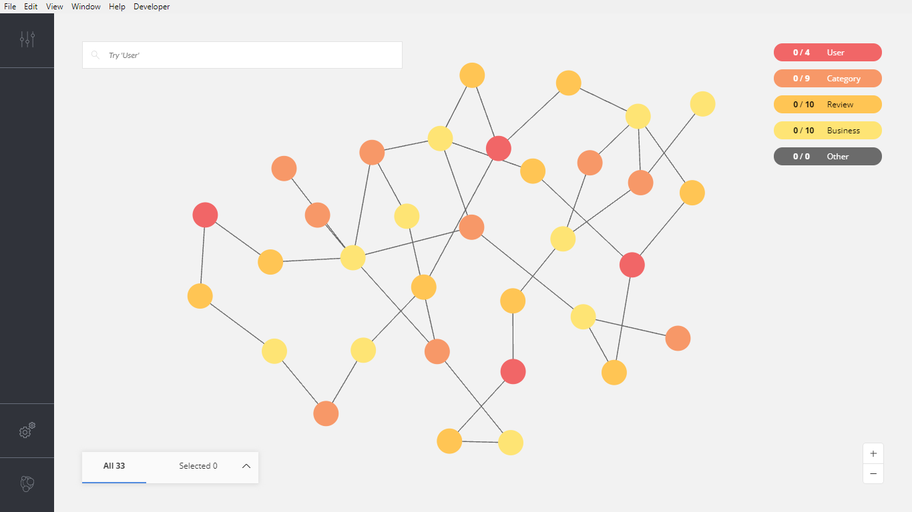
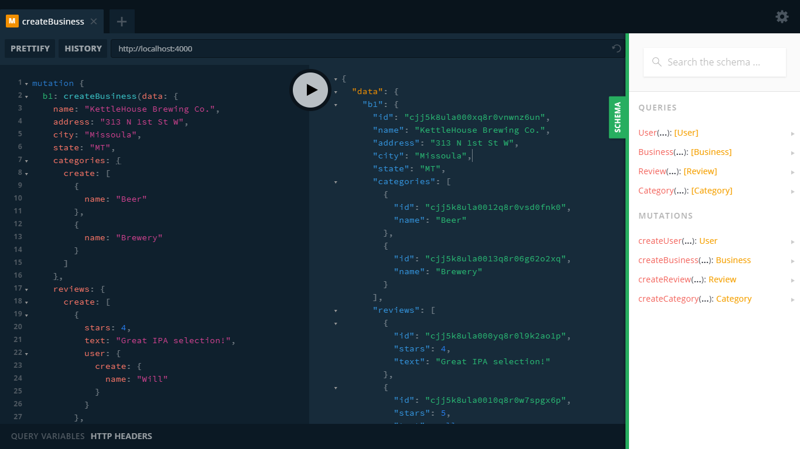

# GRANDstack Starter

This is an example of the [GRANDstack Starter](https://grandstack.io/docs/getting-started.html) project that uses `Neo4jGraphQLServer`.



## Modifying the Schema

There are a few changes to [the schema](https://github.com/grand-stack/grand-stack-starter/blob/master/api/src/graphql-schema.js) worth noting:

* Each type receives a `@model` directive \(currently required by neo4j-graphql-binding to support various features\).  
* Some fields also receive a `@unique` directive and for every model type without an `id: ID! @unique` field, one is generated and added. 
* The Cypher statement within the `@cypher` directive for the computed `avgStars` field on the User type is written within a block string to make it easier to work with. Until they become standard, block strings for `@cypher` directive statements are supported if you use `neo4jIDL` to update your Neo4j-GraphQL schema.

These changes result in the below modified `typeDefs`:

```graphql
type User @model {
  name: String! @unique
  friends: [User] @relation(name: "FRIENDS", direction: "OUT")
  reviews: [Review] @relation(name: "WROTE", direction: "OUT")
  avgStars: Float @cypher(statement: """
    MATCH (this)-[:WROTE]->(r:Review)
    RETURN toFloat(avg(r.stars))
  """)
}

type Business @model {
  name: String! @unique
  address: String
  city: String
  state: String
  reviews: [Review] @relation(name: "REVIEWS", direction: "IN")
  categories: [Category] @relation(name: "IN_CATEGORY", direction: "OUT")
}

type Review @model {
  stars: Int
  text: String
  business: Business @relation(name: "REVIEWS", direction: "OUT")
  user: User @relation(name: "WROTE", direction: "IN")
}

type Category @model {
  name: ID! @unique
  businesses: [Business] @relation(name: "IN_CATEGORY", direction: "IN")
}
```

## Seeding the Database



Using these `typeDefs` and generated nested `create` and `connect` mutations, we can now run a modified version of [the batch mutation](https://github.com/grand-stack/grand-stack-starter/blob/master/api/src/seed/seed-mutations.js) used to seed the database:

```graphql
mutation {
  b1: createBusiness(data: {
    name: "KettleHouse Brewing Co.",
    address: "313 N 1st St W",
    city: "Missoula",
    state: "MT",
    categories: {
      create: [
        {
          name: "Beer"
        },
        {
          name: "Brewery"
        }
      ]
    },
    reviews: {
      create: [
        {
          stars: 4,
          text: "Great IPA selection!",
          user: {
            create: {
              name: "Will"
            }
          }
        },
        {
          stars: 5,
          user: {
            create: {
              name: "Jenny"
            }
          }
        }
      ]
    }
  }) {
    id
    name
    address
    city
    state
    categories {
      id
      name
    }
    reviews {
      id
      stars
      text
    }
  }
  b2: createBusiness(data: {
    name: "Imagine Nation Brewing",
    address: "1151 W Broadway St",
    city: "Missoula",
    state: "MT",
    categories: {
      connect: [
        {
          name: "Beer"
        },
        {
          name: "Brewery"
        }
      ]
    },
    reviews: {
      create: {
        stars: 3,
        user: {
          create: {
            name: "Angie"
          }
        }
      }
    }
  }) {
    id
    name
    address
    city
    state
    categories {
      id
      name
    }
    reviews {
      id
      stars
      text
    }
  }
  b3: createBusiness(data: {
    name: "Ninja Mike's",
    address: "Food Truck - Farmers Market",
    city: "Missoula",
    state: "MT",
    categories: {
      create: [
        {
          name: "Restaurant"
        },
        {
          name: "Breakfast"
        }
      ]
    },
    reviews: {
      create: [
        {
          stars: 5,
          user: {
            connect: {
              name: "Jenny"
            }
          }
        },
        {
          stars: 4,
          text: "Best breakfast sandwich at the Farmer's Market. 
                Always get the works.",
          user: {
            connect: {
              name: "Will"
            }
          }
        }
      ]
    }
  }) {
    id
    name
    address
    city
    state
    categories {
      id
      name
    }
    reviews {
      id
      stars
      text
    }
  }
  b4: createBusiness(data: {
    name: "Market on Front",
    address:"201 E Front St",
    city:"Missoula",
    state:"MT",
    categories: {
      create: [
        {
          name: "Coffee"
        },
        {
          name: "Cafe"
        },
        {
          name: "Deli"
        }
      ],
      connect: [
        {
          name: "Restaurant"
        },
        {
          name: "Breakfast"
        }
      ]
    },
    reviews: {
      create: {
        stars: 4,
        user: {
          create: {
            name: "Bob"
          }
        }
      }
    }
  }) {
    id
    name
    address
    city
    state
    categories {
      id
      name
    }
    reviews {
      id
      stars
      text
    }
  }
  b5: createBusiness(data: {
    name: "Missoula Public Library",
    address: "301 E Main St",
    city: "Missoula",
    state: "MT",
    categories: {
      create: {
        name: "Library"
      }
    },
    reviews: {
      create: {
        stars: 3,
        text: "Not a great selection of books, but fortunately the 
              inter-library loan system is good. Wifi is quite slow. 
              Not many comfortable places to site and read. Looking 
              forward to the new building across the street in 2020!",
        user: {
          connect: {
            name: "Will"
          }
        }
      }
    }
  }) {
    id
    name
    address
    city
    state
    categories {
      id
      name
    }
    reviews {
      id
      stars
      text
    }
  }
  b6: createBusiness(data: {
    name: "Zootown Brew",
    address:"121 W Broadway St",
    city:"Missoula",
    state:"MT",
    categories: {
      connect: {
        name: "Coffee"
      }
    },
    reviews: {
      create: {
        stars: 5,
        user: {
          connect: {
            name: "Angie"
          }
        }
      }
    }
  }) {
    id
    name
    address
    city
    state
    categories {
      id
      name
    }
    reviews {
      id
      stars
      text
    }
  }
  b7: createBusiness(data: {
    name:"Hanabi",
    address: "723 California Dr",
    city: "Burlingame",
    state: "CA",
    categories: {
      create: {
        name: "Ramen"
      },
      connect: {
        name: "Restaurant"
      }
    },
    reviews: {
      create: {
        stars: 5,
        user: {
          connect: {
            name: "Jenny"
          }
        }
      }
    }
  }) {
    id
    name
    address
    city
    state
    categories {
      id
      name
    }
    reviews {
      id
      stars
      text
    }
  }
  b8: createBusiness(data: {
    name:"Philz Coffee",
    address: "113 B St",
    city: "San Mateo",
    state: "CA",
    categories: {
      connect: [
        {
          name: "Coffee"
        },
        {
          name: "Breakfast"
        }
      ]
    }
  }) {
    id
    name
    address
    city
    state
    categories {
      id
      name
    }
  }
  b9: createBusiness(data: {
    name: "Alpha Acid Brewing Company",
    address: "121 Industrial Rd #11",
    city: "Belmont",
    state: "CA",
    categories: {
      connect: {
        name: "Brewery"
      }
    }
  }) {
    id
    name
    address
    city
    state
    categories {
      id
      name
    }
  }
  b10: createBusiness(data: {
    name: "San Mateo Public Library Central Library",
    address: "55 W 3rd Ave",
    city: "San Mateo",
    state: "CA",
    categories: {
      connect: {
        name: "Library"
      }
    },
    reviews: {
      create: {
        stars: 4,
        user: {
          connect: {
            name: "Bob"
          }
        }
      }
    }
  }) {
    id
    name
    address
    city
    state
    categories {
      id
      name
    }
  }
}
```

