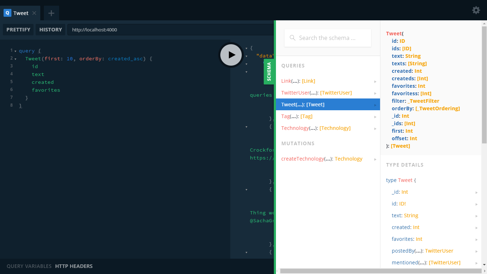

# GraphQL Community Graph

For managing additional Neo4j instances with [Neo4j-GraphQL](https://github.com/neo4j-graphql/neo4j-graphql) installed, you can provide an additional binding configuration to the `bindings` parameter. If the Neo4j-GraphQL extension is not available, then you can use the [neo4j-graphql-js](https://www.npmjs.com/package/neo4j-graphql-js) package to directly translate your GraphQL requests to Cypher requests. 

## With Multiple Bindings

In this example, we build a binding for your local server using `typeDefs` and for the [GraphQL Community Graph](http://graphql.communitygraph.org/) remote endpoint using `twitterTypeDefs`, from twitter schema supported by the API generated by the Neo4j-Graphql extension on the remote endpoint.

### Local Schema

```graphql
const typeDefs = `
  type Technology @model {
    name: String! @unique
    integration: [Technology] @relation(
      name: "HAPPINESS", 
      direction: OUT
    )
  }
`;
```

The following is a modified version of the [twitter schema](https://github.com/grand-stack/grand-stack-starter/blob/twitter/api/src/graphql-schema.js) from the GraphQL Community Graph. Each type has received a `@model` directive. There are no further changes made because the endpoint is **read-only** and thus does not allow the schema or data to be modified.

### Remote Schema

```graphql
const twitterTypeDefs = `
  type Link @model {
    url: ID!
  }
  type TwitterUser @model {
    id: ID!
    screen_name: String!
    name: String
    location: String
    followers: Int
    following: Int
    statuses: Int
    profile_image_url: String
    posted: [Tweet] @relation(name:"POSTED", direction:"OUT")
  }
  type Tweet @model {
    id: ID!
    text: String
    created: Int
    favorites: Int
    postedBy: TwitterUser @relation(name:"POSTED", direction:"IN")
    mentioned: [TwitterUser] @relation(name:"MENTIONED", direction:"OUT")
    reply: Tweet @relation(name:"REPLIED_TO", direction:"OUT")
    retweeted: Tweet @relation(name:"RETWEETED", direction:"OUT")
    links: [Link] @relation(name:"LINKED", direction:"OUT")
    tags: [Tag] @relation(name:"TAGGED", direction:"OUT")
  }
  type Tag @model {
    name: ID!
    tagged: [Tweet] @relation(name:"TAGGED", direction:"IN")
  }
`;
```

Now we can setup the server, using `typeDefs` for our local Neo4j instance and `twitterTypeDefs` for the remote GraphQL Community Graph.

### Server Setup

```javascript
import { v1 as neo4j } from 'neo4j-driver';
import { Neo4jGraphQLServer } from 'neo4j-graphql-server';

const driver = neo4j.driver(
  process.env.NEO4J_URI || "bolt://localhost:7687",
  neo4j.auth.basic(
    process.env.NEO4J_USER || "neo4j",
    process.env.NEO4J_PASSWORD || "neo4j"
  )
);

const GraphQLCommunityGraphDriver = neo4j.driver(
  "bolt://107.170.69.23:7687",
  neo4j.auth.basic("graphql", "graphql")
);

const server = Neo4jGraphQLServer({
  typeDefs: typeDefs,
  driver: driver,
  log: true,
  bindings: {
    twitter: {
      typeDefs: twitterTypeDefs,
      driver: GraphQLCommunityGraphDriver,
      readOnly: true
    }
  }
});

server.listen().then( ({ url }) => {
  console.log(`🚀 Server ready at ${url}`);
});

```

Notice the `readOnly` parameter set to `true` in the configuration object for the `twitter` binding because the GraphQL Community Graph server only provides read access. 

We can now __use the same auto-generated query types produced by the Neo4j-GraphQL extension to read data from the remote GraphQL Community Graph while also using a binding to manage a local Neo4j instance. 



### Remote Query

This query obtains the first 5 most recently created `Tweet` nodes that contain exactly the text "GRAND". A generated `Tweet` resolver uses the `twitter` binding to delegate processing of the Tweet query type to the GraphQL Community Graph endpoint. 

`Request`

```graphql
query {
  Tweet(
    first: 5, 
    orderBy: created_desc, 
    filter: { text_contains: "GRAND" }
   ) {
    id
    text
  }
}
```

`Response`

```graphql
{
  "data": {
    "Tweet": [
      {
        "id": "1013844932883304450",
        "text": "Mortality - Tool for querying US mortality data, 
                modeled in Neo4J with React/GraphQL interface 
                (GRAND stack). https://t.co/chMrWP9SqC #neo4j"
      },
      {
        "id": "1012693204834177024",
        "text": "RT @sfrechette: Just found out about this today ;-) 
                GRANDstack - Build full stack graph applications with
                ease. https://t.co/Mjprm3ZmHo #gr…"
      },
      {
        "id": "1012690404418846720",
        "text": "RT @sfrechette: Just found out about this today ;-) 
                GRANDstack - Build full stack graph applications with 
                ease. https://t.co/Mjprm3ZmHo #gr…"
      },
      {
        "id": "1012399297369985024",
        "text": "RT @jsmonthlylondon: Want to find out more about the 
                #GRAND stack and @neo4j check the talk from @lyonwj 
                in our meetup, back in November…"
      },
      {
        "id": "1012377131911909376",
        "text": "Just found out about this today ;-) GRANDstack - 
                Build full stack graph applications with ease.… 
                https://t.co/Q002zqbbSf"
      }
    ]
  }
}
```

## With neo4j-graphql-js

It may be that a Neo4j instance does not have the Neo4j-GraphQL endpoint available. Or perhaps the generated API offered by the extension does not cover everything in the database you want to access. In such cases, the `neo4j-graphql-js` package can be used to directly translate GraphQL requests to Cypher requests, as shown in the following example.

### Server Setup

In this scenario, you can use the unmodified version of the twitter schema and `resolvers` that all use `neo4jgraphqljs`.

```javascript
import { v1 as neo4j } from 'neo4j-driver';
import { Neo4jGraphQLServer } from 'neo4j-graphql-server';
import { neo4jgraphql } from 'neo4j-graphql-js';

const driver = neo4j.driver(
  process.env.NEO4J_URI || "bolt://localhost:7687",
  neo4j.auth.basic(
    process.env.NEO4J_USER || "neo4j",
    process.env.NEO4J_PASSWORD || "neo4j"
  )
);

const GraphQLCommunityGraphDriver = neo4j.driver(
  "bolt://107.170.69.23:7687",
  neo4j.auth.basic("graphql", "graphql")
);

const typeDefs = `
  type Link {
    url: ID!
  }
  type TwitterUser {
    id: ID!
    screen_name: String!
    name: String
    location: String
    followers: Int
    following: Int
    statuses: Int
    profile_image_url: String
    posted(first: Int = 10, offset: Int = 0): [Tweet] @relation(name:"POSTED", direction:"OUT")
  }
  type Tweet {
    id: ID!
    text: String
    created: Int
    favorites: Int
    postedBy: TwitterUser @relation(name:"POSTED", direction:"IN")
    mentioned: [TwitterUser] @relation(name:"MENTIONED", direction:"OUT")
    reply: Tweet @relation(name:"REPLIED_TO", direction:"OUT")
    retweeted: Tweet @relation(name:"RETWEETED", direction:"OUT")
    links: [Link] @relation(name:"LINKED", direction:"OUT")
    tags: [Tag] @relation(name:"TAGGED", direction:"OUT")
  }
  type Tag {
    name: ID!
    tagged: [Tweet] @relation(name:"TAGGED", direction:"IN")
  }
  type Query {
    users(id: ID, name: String, first: Int = 10, offset: Int = 0): [TwitterUser] 
    tweets(id: ID, text: String, first: Int = 10, offset: Int = 0): [Tweet]
    tag(name: ID!): Tag
  }
`;

const resolvers = {
  Query: {
    users: neo4jgraphql,
    tweets: neo4jgraphql,
    tag: neo4jgraphql
  }
};

const server = Neo4jGraphQLServer({
  typeDefs: typeDefs,
  resolvers: resolvers,
  driver: driver,
  context: {
    driver: GraphQLCommunityGraphDriver
  },
  log: true
});

server.listen().then( ({ url }) => {
  console.log(`🚀 Server ready at ${url}`);
});
```


