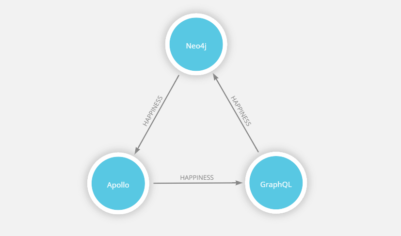
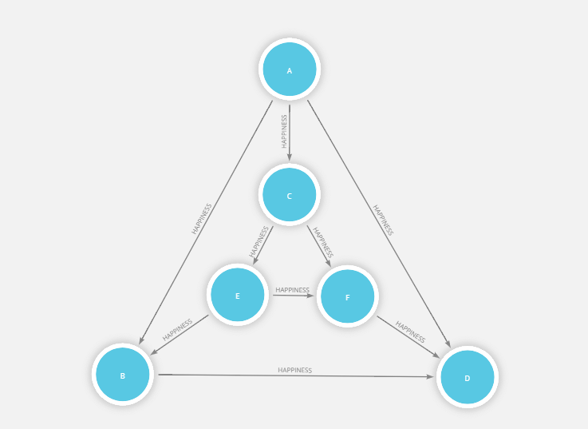

# Neo4j GraphQL Server

## Installation

```text
npm install -s neo4j-graphql-server
```

## Strategy

This package uses [neo4j-graphql-binding](https://www.npmjs.com/package/neo4j-graphql-binding) with [Apollo Server](https://www.apollographql.com/docs/apollo-server/v2/) to make it easier to get started using a generated API or setting up multiple bindings.



The following describes the server setup process based on the default configuration:

1. [neo4jIDL](https://neo4j-graphql-server.gitbook.io/docs/neo4j-graphql-binding/neo4jidl) is called to update your Neo4j-GraphQL schema.  
2. [neo4jAssertConstraints](https://neo4j-graphql-server.gitbook.io/docs/neo4j-graphql-binding/neo4jassertconstraints) is used to support a `@unique` directive by [creating constraints](https://neo4j.com/docs/developer-manual/current/get-started/cypher/labels-constraints-and-indexes/) in your Neo4j instance. It uses the [APOC extension](https://neo4j-contrib.github.io/neo4j-apoc-procedures/). 
3. [buildNeo4jTypeDefs](https://neo4j-graphql-server.gitbook.io/docs/neo4j-graphql-binding/buildneo4jtypedefs) then augments the same typeDefs provided to your Neo4j-GraphQL schema.  
4. [neo4jGraphQLBinding](https://neo4j-graphql-server.gitbook.io/docs/neo4j-graphql-binding/neo4jgraphqlbinding) is used to create a [custom GraphQL Binding](https://oss.prisma.io/content/GraphQL-Binding/04-Creating-your-own-Binding.html) over the resulting augmented typeDefs. The binding is added into your server's [context parameter](https://www.apollographql.com/docs/apollo-server/v2/api/apollo-server.html#constructor-options-lt-ApolloServer-gt) \(default key: 'neo4j' so you can access it the way you normally would access a GraphQL Binding.  
5. [buildNeo4jResolvers](https://neo4j-graphql-server.gitbook.io/docs/neo4j-graphql-binding/buildneo4jresolvers) then generates any unprovided resolvers for query and mutation types that were generated or that use a [@cypher directive](https://github.com/neo4j-graphql/neo4j-graphql#directives). Each resolver uses a created binding to delegate all such queries and mutations to a Neo4j-GraphQL endpoint.  
6. Finally, steps 1-5 are processed for any additional binding configurations provided in `bindings` and the resulting `typeDefs` and `resolvers` are merged and provided to Apollo Server.

## Quick Start

This example server setup uses only auto-generated query and mutation types.

`typeDefs`

```graphql
const typeDefs = `
  type Technology @model {
    name: String! @unique
    integration: [Technology] @relation(
      name: "HAPPINESS", 
      direction: OUT
    )
  }
`;
```

`Server`

```javascript
import { Neo4jGraphQLServer } from 'neo4j-graphql-server';
import { v1 as neo4j } from 'neo4j-driver';

const driver = neo4j.driver(
  process.env.NEO4J_URI || "bolt://localhost:7687",
  neo4j.auth.basic(
    process.env.NEO4J_USER || "neo4j",
    process.env.NEO4J_PASSWORD || "neo4j"
  )
);

const server = Neo4jGraphQLServer({
  typeDefs: typeDefs,
  driver: driver
});

server.listen().then( ({ url }) => {
  console.log(`🚀 Server ready at ${url}`);
});
```

If you navigate to [http://localhost:4000/](http://localhost:4000/), you should see [GraphQL Playground](https://github.com/prismagraphql/graphql-playground).

### Nested Mutation

This example uses nested [create and connect](https://www.prisma.io/docs/reference/prisma-api/mutations-ol0yuoz6go/#examples) mutations and takes advantage of the [@unique](https://www.prisma.io/docs/1.4/reference/service-configuration/data-modelling-%28sdl%29-eiroozae8u/#field-constraints) directive to create the above graph with three Technology nodes.

`Request`

```graphql
 mutation {
  createTechnology(
    data: {
      name: "Apollo",
      integration: {
        create: [
          {
            name: "GraphQL",
            integration: {
              create: [
                {
                  name: "Neo4j",
                  integration: {
                    connect: [
                      {
                        name: "Apollo"
                      }
                    ]
                  }
                }
              ]
            }
          }
        ]
      }
    }
  ) {
    id        
    name
    integration {
      id
      name
      integration {
        id
        name
        integration {
          id
          name
        }
      }
    }
  }
}
```

`Response`

```graphql
{
  "data": {
    "createTechnology": {
      "id": "cjj0dr5i00006fgr0tfukv1tn",
      "name": "Neo4j",
      "integration": [
        {
          "id": "cjj0dr5i00007fgr05js3fg30",
          "name": "GraphQL",
          "integration": [
            {
              "id": "cjj0dr5i00008fgr06ugrjnze",
              "name": "Apollo",
              "integration": [
                {
                  "id": "cjj0dr5i00006fgr0tfukv1tn",
                  "name": "Neo4j"
                }
              ]
            }
          ]
        }
      ]
    }
  }
}
```

### Query

Now we can run the following query:

`Request`

```graphql
query {
  Technology(orderBy: name_desc) {
    id
    name
  }
}
```

`Response`

```graphql
{
  "data": {
    "Technology": [
      {
        "id": "cjj0dr5i00006fgr0tfukv1tn",
        "name": "Neo4j"
      },
      {
        "id": "cjj0dr5i00007fgr05js3fg30",
        "name": "GraphQL"
      },
      {
        "id": "cjj0dr5i00008fgr06ugrjnze",
        "name": "Apollo"
      }
    ]
  }
}
```

## More Examples

### Using @cypher Directives

The below `typeDefs` shows the use of the `@cypher` directive for a computed field, a query, and a mutation type. Any `query` and `mutation` types, or `resolvers`, that you provide are _not overwritten_ by the schema augmenting process.

`typeDefs`

```graphql
type Movie @model {
  title: String!
  released: Int
  actors: [Person] @relation(name:"ACTED_IN",direction:IN)
  # computed field
  directors: [Person] @cypher(statement: """
    MATCH (this)<-[:DIRECTED]-(d) RETURN d
  """)
}
type Person @model {
  name: String!
  born: Int
  movies: [Movie] @relation(name:"ACTED_IN")
}
type QueryType {
  coActors(name:ID!): [Person] @cypher(statement:"""
    MATCH (p:Person {name:$name})-[:ACTED_IN]->()<-[:ACTED_IN]-(co) 
    RETURN distinct co
  """)
}
type MutationType {
  rateMovie(user:ID!, movie:ID!, rating:Int!): Int @cypher(statement: """
    MATCH (p:Person {name:$user}),(m:Movie {title:$movie}) 
    MERGE (p)-[r:RATED]->(m) SET r.rating=$rating 
    RETURN r.rating
  """)
}
schema {
   query: QueryType
   mutation: MutationType
}
```

The corresponding `resolvers` can be provided if you want to handle the data or be explicit. Otherwise, they will be generated.

```javascript
Query: {
  coActors: (obj, params, ctx, info) => {
    return ctx.neo4j.query.coActors(params, info);
  }
},
Mutation: {
  rateMovie: async (obj, params, ctx, info) => {
    const result = await ctx.neo4j.mutation.rateMovie(params, info);
    // using result
    return result;
  }
}
```

### Using Multiple Bindings

See the section on [using the GraphQL Community Graph](https://neo4j-graphql-server.gitbook.io/docs/graphql-community-graph) for an example of configuring bindings for multiple local or remote Neo4j instances with the Neo4j-GraphQL extension available.

### Prism Graph

This mutation creates a [Prism Graph](http://mathworld.wolfram.com/PrismGraph.html)! 🌈



```graphql
mutation {
  createTechnology(
    data: {
      name: "A",
      integration: {
        create: [
          {
            name: "B",
            integration: {
              connect: {
                name: "D"
              }
            }
          },
          {
            name: "C",
            integration: {
              create: [
                {
                  name: "E",
                  integration: {
                    connect: [
                      {
                        name: "F"
                      },
                      {
                        name: "B"
                      }
                    ]
                  }
                },
                {
                  name: "F",
                  integration: {
                    connect: {
                      name: "D"
                    }
                  }
                }
              ]
            }
          },
          {
            name: "D"
          }
        ]
      }
    }) {
    id        
    name
    integration {
      id
      name
      integration {
        id
        name
        integration {
          id
          name
        }
      }
    }
  }
}
```

## API Reference

All the same arguments as Apollo Server are supported, in addition to the following:

* `typeDefs` \(required\): Your GraphQL type definitions in SDL format  
* `driver`\(required\): Your Neo4j driver instance \(More info [here](https://www.npmjs.com/package/neo4j-driver)\).  
* `calls` Configures the use of `neo4jAssertConstraints` and `neo4jIDL` during setup.
  * `assert` \(default: `true`\): A boolean control that updates the unique property constraints in your Neo4j instance. 
  * `idl` \(default: `true`\): A boolean control that updates your Neo4j-GraphQL schema.  
* `augment` Configures the use of `buildNeo4jTypeDefs` and `buildNeo4jResolvers`during setup. 
  * `typeDefs`
    * `query` \(default: `true`\) A boolean controlling the generation of query types.
    * `mutation` \(default: `true`\) A boolean controlling the generation of mutation types.
  * `resolvers`
    * `query` \(default: `true`\) A boolean controlling the generation of resolvers for query types.
    * `mutation` \(default: `true`\) A boolean controlling the generation of resolvers for mutation types.  
* `indexConfig` Configures the management of generated `id` fields.
  * `use` \(default/only: `'cuid'`\) Configures what method to use when generating id field values.   
* `bindingKey` \(default: `'neo4j'`\): The key used when storing the created binding into the server's context object.  
* `log` \(default: `false`\): Logs the result of any delegated query or mutation operation, `buildNeo4jTypeDefs`,`neo4jAssertConstraints`, and `neo4jIDL`.  
* `readOnly` \(default: false\): If you only have read access to a remote server, then you can use this parameter to turn off all processes that assume write access. Mutation types are not generated, `idl` and `assert` calls are prevented, and `id` fields are not generated and managed because we would never be able to write them to the instance. So, this results in forcing the following configuration: 

```text
calls: { 
  idl: false,
  assert: false
},
augment: {
  mutation: false
},
indexConfig: false
```

* `bindings` An object of bindings where each key is the name for a binding and each value is a configuration object containing the parameters: `typeDefs`, `resolvers`, `driver`, `calls`, `augment,` `log`, and `readOnly`. This can be used to network together a GraphQL binding for multiple remote Neo4j instances with the Neo4j-GraphQL extension installed.

#### Default Configuration

```text
Neo4jGraphQLServer({
  typeDefs: typeDefs,
  resolvers: resolvers,
  driver: driver,
  calls: {
    assert: true, 
    idl: true
  },
  augment: {
    typeDefs: {
      query: true,
      mutation: true
    },
    resolvers: {
      query: true, 
      mutation: true
    }
  },
  indexConfig: {
    use: "cuid"
  },
  bindingKey: 'neo4j',
  log: true,
  readOnly: false,
  bindings: {
    ...
  }
});
```

